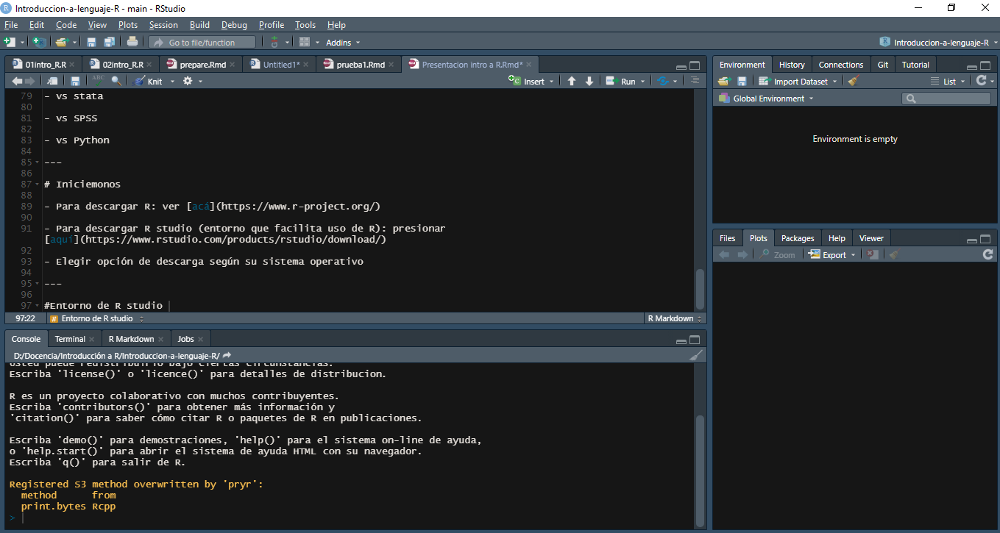

```{r setup, include=FALSE, cache=FALSE}
require("knitr")
options(htmltools.dir.version = FALSE)
pacman::p_load(RefManageR)
knitr::opts_chunk$set(warning=FALSE,
             message=FALSE,
             echo=TRUE,
             cache = TRUE,fig.width=2, fig.height=5.2)
```

class: inverse middle center

# **Introducción a R**

Carlos Budnevich 

Métodos estadísticos multivariados de interdependencia

6 de septiembre 2021

---

# Programa de hoy 

- Sección teórica: Sobre los fundamentos y algunas consideraciones preliminares

- Sección práctica: Revisión de código básico de manipulación y exploración de datos

- El lema: *¡Aprender haciendo!*
.center[

]
---

# Sobre R

- Es un lenguaje de programación enfocado en el análisis de datos  

- El paradigma que subyace se vincula con la orientación a objetos y la creación de funciones 

- En un comienzo, solemos utilizar funciones ya creadas disponibles en las diferentes librerías

- Curva de aprendizaje lento: Al principio es un poco más complejo, luego más sencillo y un_ va advirtiendo la enorme versatilidad (por ej., estas laminas fueron creadas en R)
---

# ¿Por qué usarlo?

- Gratuito y de código abierto

- Versatilidad en su uso en términos de las multiples análisis estadisticos que se pueden hacer en R

- No sólo análisis estadístico: Creación de docs. de presentación, páginas web, otros.

- Alta potencia grafica: Genera gráficos con una calidad dificil de replicar por otros softwares/lenguajes

- Eficiencia, reproducibilidad, y control sobre el flujo de trabajo: Código abierto que favorece trabajo colaborativo 

---


# Comparación R vs otros lenguajes/software 

- vs stata: R es más versatil, es gratuito, y alta ayuda en comunidad online 

- vs SPSS: R es más versatil, potente, es gratuito, más potencia gráfica, y alta ayuda en comunidad online 

- vs Python: Son más parecidos, pues quizás la ventaja de Python es que procesa más rápido volumenes de datos masivos
---
 
# Iniciemonos

- Para descargar R: ver [acá](https://www.r-project.org/)

- Para descargar R studio (entorno que facilita uso de R): presionar [aquí](https://www.rstudio.com/products/rstudio/download/)

- Elegir opción de descarga según su sistema operativo

---
 

#Entorno de R studio 



---

# Elementos básicos de funcionamiento 

- Objetos y funciones como unidad básica de funcionamiento

- Correr código o sintaxis en el editor de sintaxis

- Los nuevos objetos creados se van guardando en la pestaña superior derecha "environment"

- Gráficos se van mostrando en pestaña inferior derecha, en "plots"

---

# Veamos un breve ejemplo

- Creación de un objeto: Se verá en nuestro entorno de trabajo

```{r, include=TRUE}
x<- 10 + 15
x

```

- Cargar una base de datos: También aparecerá en nuestra pestaña "environment" 

```{r, include=TRUE}
load("input/data/original/data.RData")

```

---

# Funciones

- Definamos una función 

```{r}
fahrenheit_to_celsius <- function(temp_F) {
  temp_C <- (temp_F - 32) * 5 / 9
  return(temp_C)
}

fahrenheit_to_celsius(32)

```
- Pero... No es necesario complicarse tanto y podemos hacer uso de las funciones ya creadas que proporcionan las librerías. En caso de programación más avanzada puede ser útil el crear nuestras propias funciones

---

class:center, middle

**Descargar Zip con archivos e ir al script "taller_practico_introaR"**

## Recuerden el lema: ¡Aprender haciendo! 


